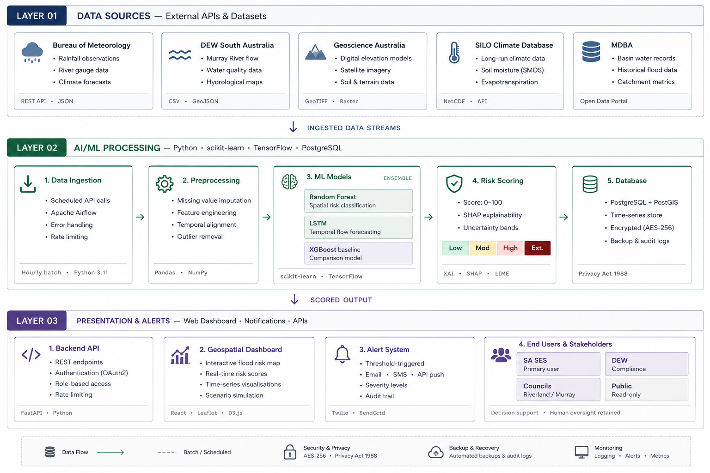

# flood-risk-prototype
AI-based flood risk prediction prototype for South Australia
The Flood Risk Prototype is an AI-based flood risk prediction system designed to support early flood risk identification in South Australia.

The project aims to use historical and environmental data, including rainfall, river levels, weather conditions, and other relevant variables, to develop a machine learning model capable of estimating flood risk.

The system is designed as a prototype that integrates data processing, artificial intelligence, a backend API, and an interactive dashboard to provide accessible flood risk information.

## Problem Statement

Flooding is one of the most significant natural hazards affecting communities, infrastructure, and the environment. Traditional flood forecasting systems can be complex and may require significant technical infrastructure.

This project explores how Artificial Intelligence and Machine Learning can be used to analyse historical and environmental data to identify patterns associated with flood events and provide an accessible flood risk prediction tool.

The prototype focuses on South Australia and aims to support improved disaster preparedness, climate resilience, and informed decision-making.

## Project Architecture

The proposed system follows a modular architecture consisting of:

1. **Data Sources** – Historical flood, rainfall, weather, river level, and environmental data.
2. **Data Processing** – Data cleaning, preprocessing, feature engineering, and preparation for machine learning.
3. **AI/ML Model** – A machine learning model used to predict or classify flood risk.
4. **Backend API** – A FastAPI-based backend that connects the trained model with the application.
5. **Dashboard** – An interactive user interface for displaying flood risk predictions and relevant information.

### Architecture Diagram

The architecture diagram from the project report will be added here.

## Repository Structure

    flood-risk-prototype/
    ├── data/          # Datasets and processed data
    ├── notebooks/     # Data analysis and machine learning experiments
    ├── backend/       # FastAPI backend and model integration
    ├── dashboard/     # User interface and visualisation dashboard
    ├── docs/          # Project documentation and architecture diagrams
    ├── .gitignore
    └── README.md

## Technologies

- Python
- Machine Learning / Artificial Intelligence
- FastAPI
- React
- Docker
- Cloud technologies

## Project Status

This project is currently under development as a prototype for an AI-based flood risk prediction system in South Australia.
